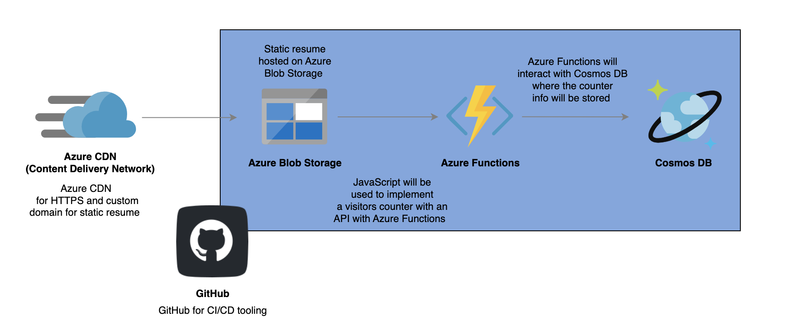

# azure-resume
Azure Static Resume, following ACG Project video.
##  Overview 
The goal is to build a static resume integrated into GitHub and hosted on Microsoft Azure with Blob Storage, Azure Functions and CosmosDB.

## Section 1: Building the Frontend
1. Setting up the Version Control 
    - We'll create our GitHub Repo 
    - Clone the starter code
    - Understand the project structure 
2. Update the HTML and Implement Counter 
    - We'll update the HTML with our resume info 
    - Write the JavaScript code for the visitor counter
3. Test locally and push changes to GitHub
    - We'll view our website locally and push all our changes to GitHub

## Section 2: Building the Backend 
1. Setting up our Cosmos DB resources 
    - We’ll create out Cosmos DB account, database, and container, and data. 
2. Setting up our Azure Function 
    - We’ll create our Azure Function to interact with our Cosmos DB counter data 
        - Azure Functions is a serverless solution that allows us to create pieces of code that are event driven and not have to worry about the infrastructure behind those pieces of code 
        - Azure Functions also has these things called bindings that allow us to connect others resources to our functions 
3. Test Locally 
    - We’ll test our function locally and make sure we can view our counter data in the browser and in our website locally 

## Section 3: Deploying to Azure 
1. Deploy our Azure Function
    - We'll deploy our Azure Function to Azure, grab it’s URL and update our JavaScript code with it
2. Deploy Blob Container 
    - We'll deploy our static site to our blob container 
3. Setup Azure CDN 
    - We'll set up Azure CDN for HTTPS and custom domain support 

## Section 4: Building our CI/CD Pipeline
1. Create our frontend workflow 
    - We’ll create the GitHub workflow responsible for deploying the frontend of our project 
2. Implement Unit testing 
    - We’ll create unit test our Azure Functions code as part of it’s deployment workflow 
3. Create our backend workflow 
    - We’ll create the GitHub workflow responsible for deploying the backend of our project 